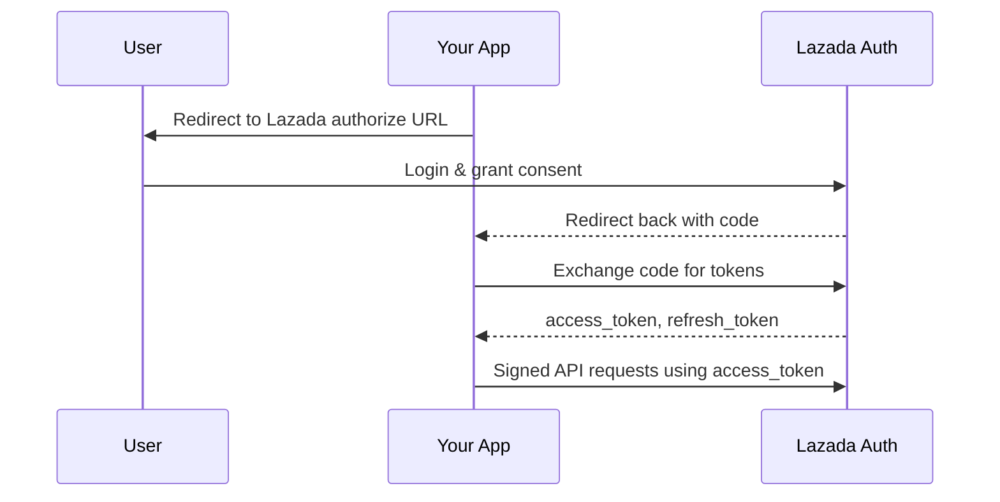
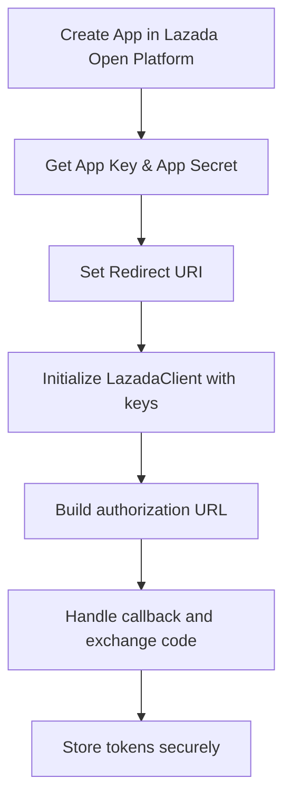

## @talok/lazada-openapi

TypeScript Lazada Open API client with robust signing, OAuth helpers, and typed errors.

### Install

```bash
npm i @talok/lazada-openapi
```

### Optional: Built-in server + MySQL token storage

```ts
import {
  LazadaClient,
  MySqlTokenStore,
  startCallbackServer,
} from "@talok/lazada-openapi";

const store = new MySqlTokenStore({ uri: process.env.MYSQL_URI });
const client = new LazadaClient({
  appKey: process.env.LAZADA_APP_KEY!,
  appSecret: process.env.LAZADA_APP_SECRET!,
  redirectUri: "http://localhost:8787/lazada/callback",
  region: "th",
  tokenStore: store,
  installationId: "merchant-123",
});

await store.init();
await client.initFromStore();
await client.ensureValidToken();

// If no tokens yet, start the callback server and visit the authorization URL
const server = startCallbackServer(client, store, {
  port: 8787,
  path: "/lazada/callback",
  installationId: "merchant-123",
});
console.log("Visit:", client.buildAuthorizationUrl("state"));

// After you receive tokens once, they are stored and auto-refreshed.
```

### Quick start

```ts
import { LazadaClient } from "@thada/lazada-openapi";

const client = new LazadaClient({
  appKey: process.env.LAZADA_APP_KEY!,
  appSecret: process.env.LAZADA_APP_SECRET!,
  redirectUri: "https://your.app/callback",
  region: "th",
});

// 1) Redirect user to Lazada for consent
const url = client.buildAuthorizationUrl("optional_state");

// 2) In your callback, exchange code
// const tokens = await client.exchangeAuthCode(codeFromQuery);

// 3) Call any Lazada API (signed automatically)
// const me = await client.request("GET", "/seller/get", {});
```

### Error handling

All errors are instances of `LazadaError` subclasses with stable shape:

```ts
try {
  await client.request("GET", "/seller/get");
} catch (err) {
  if (err && typeof err === "object" && (err as any).code) {
    // handle typed LazadaError
  }
}
```

### LAZADA Seller authorization introduction



### LAZADA Configure seller authorization



### LAZADA HTTP request sample

```ts
// Fetch products sample
const products = await client.request("GET", "/products/get", {
  offset: 0,
  limit: 10,
});

// Update price sample
const resp = await client.request(
  "POST",
  "/product/price/update",
  {},
  {
    // Lazada requires specific body fields for this endpoint
  }
);
```

### Notes

- The client auto-signs requests using HMAC-SHA256 per Lazada spec.
- Regions supported: sg, my, ph, th, vn, id (and global).
- `refreshAccessToken()` helps rotate tokens using the refresh token.

### Repository

- GitHub: [talok/lazada-openapi](https://github.com/talok/lazada-openapi)
- Issues: [Report a bug](https://github.com/talok/lazada-openapi/issues)
